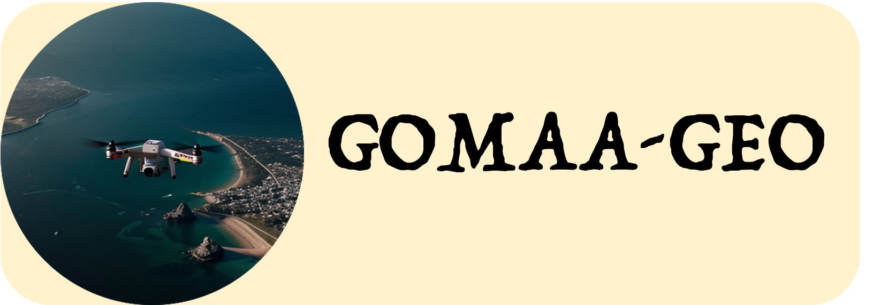

# GOMAA-Geo
PyTorch implementation of _GOMAA-Geo: GOal Modality Agnostic Active Geo-localization_

<div align="center">


[]()
[]()
[]()</center>

[Anindya Sarkar*](https://scholar.google.co.in/citations?user=2hQyYz0AAAAJ&hl=en),
[Srikumar Sastry*](https://sites.wustl.edu/srikumarsastry/),
[Aleksis Pirinen](https://aleksispi.github.io/),
[Chongjie Zhang](https://engineering.wustl.edu/faculty/Chongjie-Zhang.html),
[Nathan Jacobs](https://jacobsn.github.io/),
[Yevgeniy Vorobeychik](https://vorobeychik.com/)
(*Corresponding Author)
</div>

This repository is the official implementation of [_GOMAA-Geo_](), a goal modality agnostic active geo-localization agent that can geo-localize a goal location -- specified as an aerial patch, ground-level image, or textual description -- by navigating partially observed aerial imagery.


## ⏭️ Next
- [ ] Update Gradio demo
- [ ] Release Models to 🤗 HuggingFace
- [x] Release PyTorch `ckpt` files for all models

## 🧑‍💻 Setup and Training
Look at [train.md](/scripts/train.md) for details on setting up the environment and training models on your own data.

## 🐨 Model Zoo
Download GOMAA-Geo models from the links below:


## 📑 Citation

```bibtex
@article{gomaa-geo,
  title={GOMAA-Geo: GOal Modality Agnostic Active Geo-localization},
  author={Sarkar, Anindya and Sastry, Srikumar and Pirinen, Aleksis and Zhang, Chongjie and Jacobs, Nathan and Vorobeychik, Yevgeniy},
  booktitle={},
  year={2024}
}
```

## 🔍 Additional Links
Check out our lab website for other interesting works on geospatial understanding and mapping:
* Multi-Modal Vision Research Lab (MVRL) - [Link](https://mvrl.cse.wustl.edu/)
* Related Works from MVRL - [Link](https://mvrl.cse.wustl.edu/publications/)

